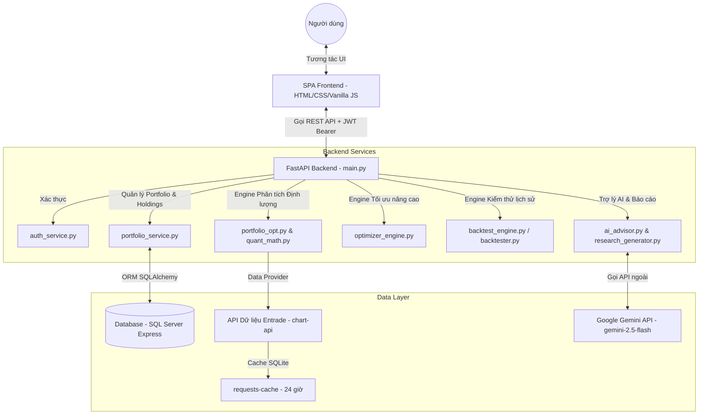

# KỊCH BẢN THUYẾT TRÌNH BÁO CÁO TOÀN BỘ HỆ THỐNG
## NVT QUANT LAB: HỆ THỐNG PHÂN TÍCH RỦI RO VÀ TỐI ƯU HÓA DANH MỤC ĐẦU TƯ ĐỊNH LƯỢNG

---

# MỤC LỤC
1. [PHẦN 1: TỔNG QUAN HỆ THỐNG (LỜI NÓI TRỰC TIẾP)](#phan-1-tong-quan-he-thong-loi-noi-truc-tiep)
   * 1.1. [Bài toán thực tế và Bản chất hệ thống](#11-bai-toan-thuc-te-va-ban-chat-he-thong)
   * 1.2. [Các tác nhân trong hệ thống](#12-cac-tuyen-nhan-trong-he-thong)
   * 1.3. [Hành trình trải nghiệm của người dùng](#13-hanh-trinh-trai-nghiem-cua-nguoi-dung)
   * 1.4. [Chức năng Trang Quant App và Tối ưu hóa Quant](#14-chuc-nang-trang-quant-app-va-toi-uu-hoa-quant)
2. [PHẦN 2: KIẾN TRÚC VÀ LUỒNG DỮ LIỆU (FLOW HỆ THỐNG)](#phan-2-kien-truc-va-luong-du-lieu-flow-he-thong)
3. [PHẦN 3: DEMO SHOW CODE THUẬT TOÁN VÀ MÔ HÌNH LÕI](#phan-3-demo-show-code-thuat-toan-va-mo-hinh-loi)
4. [PHẦN KẾT LUẬN](#phan-ket-luan)

---

# PHẦN 1: TỔNG QUAN HỆ THỐNG (LỜI NÓI TRỰC TIẾP)

“Kính chào thầy cô và các bạn hội đồng, hôm nay nhóm em xin phép được trình bày đề tài nghiên cứu và phát triển: **NVT Quant Lab - Hệ thống Phân tích Rủi ro và Tối ưu hóa Danh mục Đầu tư Định lượng**.”

### 1.1. Bài toán thực tế và Bản chất hệ thống
“Thưa thầy cô, đối với nhà đầu tư cá nhân tại thị trường chứng khoán Việt Nam, việc ra quyết định mua bán thường bị chi phối mạnh mẽ bởi cảm xúc hoặc thông tin nhiễu từ các hội nhóm. Có hai câu hỏi cốt lõi mà hầu hết nhà đầu tư cá nhân không thể tự trả lời một cách khoa học:
1. **Làm sao để phân bổ vốn tối ưu** vào các mã cổ phiếu đang nắm giữ để đạt mức Sharpe (lợi nhuận/rủi ro) cao nhất?
2. **Lập kế hoạch quản trị rủi ro thế nào** khi thị trường xảy ra biến động mạnh (Stress Test) và ước tính mức sụt giảm tối đa tài sản (VaR - Value at Risk) ra sao?

Để giải quyết bài toán này, nhóm em đã xây dựng **NVT Quant Lab** - đây **không phải** là một hệ thống đặt lệnh giao dịch chứng khoán trực tuyến thực tế, mà là một **hệ thống phân tích rủi ro định lượng, hỗ trợ đưa ra quyết định đầu tư khoa học**. Khác biệt cốt lõi của hệ thống so với các website bảng giá thông thường là chúng em cung cấp các công cụ tối ưu hóa danh mục theo thuyết danh mục hiện đại của Markowitz, mô phỏng Monte Carlo, bộ tối ưu hóa Black-Litterman tích hợp quan điểm vĩ mô, và chạy kiểm thử lịch sử (Backtest) hiệu suất của các mô hình này.”

### 1.2. Các tác nhân trong hệ thống
“Hệ thống của chúng em phân chia rõ ràng các tác nhân dựa trên phân quyền cơ sở dữ liệu thật:
*   **Nhà đầu tư cá nhân (User đã đăng nhập)**: Là tác nhân chính. Có quyền quản lý danh mục, nhập lịch sử giao dịch mua/bán (BUY/SELL), theo dõi hiệu suất thực tế danh mục, chạy mô phỏng tối ưu hóa, và trò chuyện với trợ lý AI định lượng.
*   **Khách vãng lai (Chưa đăng nhập)**: Chỉ có quyền xem trang Landing và thực hiện đăng ký/đăng nhập. Toàn bộ các route phân tích và quản lý danh mục đều được bảo vệ bởi lớp bảo mật Guard JWT.
*   **Hệ thống dữ liệu bên ngoài (External Data Providers)**: Bao gồm API giá chứng khoán EOD (End of Day) và Real-time từ Entrade (chạy qua nền tảng TCBS) dùng làm đầu vào tính toán quant.
*   **Dịch vụ Trí tuệ Nhân tạo (Gemini AI)**: Tiếp nhận các số liệu tài chính định lượng đã được Python xử lý và chuyển ngữ sang ngôn ngữ phân tích tự nhiên để hỗ trợ người dùng đọc hiểu.
*   **Cơ sở dữ liệu hệ thống**: Lưu trữ thực tế trên SQL Server (hoặc SQLite dự phòng) để đồng bộ hóa thông tin danh mục, lịch sử giao dịch, chat log và snapshots hiệu suất tài sản.”

### 1.3. Hành trình trải nghiệm của người dùng
“Khi một nhà đầu tư sử dụng hệ thống, họ sẽ đi qua một luồng nghiệp vụ khép kín như sau:
1.  **Đăng ký và Đăng nhập** tài khoản.
2.  **Khởi tạo danh mục đầu tư** mới và ghi nhận các **giao dịch thực tế (BUY/SELL)**. Hệ thống sẽ tự động tổng hợp thành số dư cổ phiếu nắm giữ (Holdings), tính giá vốn trung bình theo phương pháp Average Cost Basis, và lấy giá thị trường thời gian thực để tính lãi/lỗ hiện thời.
3.  Truy cập tính năng **Risk Analysis (Phân tích rủi ro)**: Hệ thống tự động kéo dữ liệu 1000 phiên lịch sử của các mã trong danh mục, chạy mô phỏng 10,000 danh mục ngẫu nhiên (Monte Carlo) để tìm điểm tối ưu tối đa hóa Sharpe Ratio và mô phỏng tác động sập sàn VN30 -5% (Stress Test).
4.  Người dùng tiếp tục chạy **Backtest (Kiểm thử)** chiến lược giao cắt đường trung bình SMA20/50 để đánh giá xem nếu áp dụng mô hình này trong quá khứ thì hiệu quả ra sao.
5.  Sử dụng **Advanced Optimizer (Tối ưu hóa nâng cao)** bằng mô hình **Black-Litterman** nếu muốn chèn thêm quan điểm cá nhân (ví dụ: Tôi tin chắc FPT sẽ tăng trưởng 15% năm tới với độ tự tin 80%).
6.  Cuối cùng, gọi **Trợ lý AI (AI Advisor)** để giải thích rõ các chỉ số rủi ro phức tạp bằng tiếng Việt phổ thông, và xuất báo cáo PDF/Word để lưu trữ.”

### 1.4. Chức năng Trang Quant App và Tối ưu hóa Quant
“Kính thưa thầy cô, bên cạnh việc phân tích rủi ro danh mục hiện tại, điểm nhấn chuyên sâu và học thuật lớn nhất của hệ thống nằm ở hai module:

*   **Trang Quant App (Định lượng nhanh - /quant)**: Cho phép chạy nhanh một phân tích định lượng trên rổ tài sản phân bổ đều (Equal-Weight Baseline) qua lịch sử. Hệ thống tự động tính các chỉ số nâng cao gồm Sortino (rủi ro lệch dưới), Treynor, Calmar, và sinh ra **Ma trận tương quan Heatmap** đổi màu trực quan để nhà đầu tư đánh giá mức độ đồng pha chuyển động giữa các cổ phiếu, từ đó kiểm tra hiệu quả đa dạng hóa.
*   **Trang Tối ưu hóa Quant (Advanced Optimizer - /quant/optimizer)**: Giúp tìm tỷ trọng phân bổ vốn tối ưu theo Thuyết danh mục hiện đại (MPT) thông qua nhiều thuật toán (Max Sharpe, Min Variance, Risk Parity) kết hợp chạy kiểm thử lịch sử tái cân bằng định kỳ (Rebalancing Backtest) có tính đến phí giao dịch và độ trượt giá thực tế. Kết quả được biểu diễn sinh động qua **Đường biên hiệu quả (Efficient Frontier)** và biểu đồ đóng góp rủi ro cận biên.”

---

# PHẦN 2: KIẾN TRÚC VÀ LUỒNG DỮ LIỆU (FLOW HỆ THỐNG)

“Để hệ thống hoạt động ổn định và chính xác, nhóm em đã thiết kế một kiến trúc phân tầng rõ rệt.”

### 2.1. Sơ đồ kiến trúc tổng thể
“Dưới đây là sơ đồ Mermaid thể hiện cách các thành phần trong hệ thống giao tiếp với nhau:”



### 2.2. Chi tiết các luồng xử lý dữ liệu cốt lõi

#### 2.2.1. Luồng Xác thực người dùng (Authentication Flow)
“Khi người dùng nhấn nút Đăng nhập trên trang **[Auth.js](file:///c:/Users/Admin/OneDrive/Documents/CSDL/DNT_Workspace_fefix/quant-engine/nvt_quant_lab/frontend/js/views/Auth.js)**:
1.  Frontend gửi yêu cầu POST chứa email/password đến endpoint `/api/auth/login` thuộc **[auth.py](file:///c:/Users/Admin/OneDrive/Documents/CSDL/DNT_Workspace_fefix/quant-engine/nvt_quant_lab/backend/app/api/routers/auth.py)**.
2.  Backend gọi hàm `authenticate` trong **[auth_service.py](file:///c:/Users/Admin/OneDrive/Documents/CSDL/DNT_Workspace_fefix/quant-engine/nvt_quant_lab/backend/app/services/auth_service.py)**. Mật khẩu được verify bằng thư viện `bcrypt` so sánh với mã hash trong bảng `dbo.Users`.
3.  Nếu thành công, backend sinh ra một cặp gồm: **Access Token** (JWT ngắn hạn 30 phút, ký bằng thuật toán HS256 với khóa bảo mật bí mật) và **Refresh Token** (UUID ngẫu nhiên lưu trong bảng `dbo.RefreshTokens` thời hạn 7 ngày).
4.  Frontend lưu trữ Access Token vào `localStorage` và tự động đính kèm vào tiêu đề `Authorization: Bearer <token>` ở mọi request bảo mật tiếp theo.”

#### 2.2.2. Luồng Quản lý Giao dịch và Tổng hợp Holdings
“Đây là phần thể hiện rõ nhất nghiệp vụ quản lý dữ liệu tài chính trong cơ sở dữ liệu:
*   **Dữ liệu gốc là Giao dịch**: Toàn bộ tài sản của người dùng được tái thiết lập từ lịch sử giao dịch mua/bán lưu trong bảng `dbo.Transactions` (chứa các trường: `Ticker`, `Side` BUY/SELL, `Quantity`, `Price`, `Fee`, `Tax`, `TradeDate`).
*   **Quá trình tổng hợp Holdings**: Khi gọi API lấy số dư (`/{portfolio_id}/holdings`), hàm `get_portfolio_holdings` trong **[portfolio_service.py](file:///c:/Users/Admin/OneDrive/Documents/CSDL/DNT_Workspace_fefix/quant-engine/nvt_quant_lab/backend/app/services/portfolio_service.py)** sẽ quét lịch sử giao dịch theo thứ tự thời gian tăng dần:
    *   Với lệnh **BUY**: Cộng dồn số lượng: $Quantity_{\text{holding}} = Quantity_{\text{holding}} + Q$. Cộng dồn tổng vốn gốc đã bỏ ra: $Cost_{\text{total}} = Cost_{\text{total}} + (Q \times P)$. Giá vốn bình quân được tính bằng: $Price_{\text{average}} = \frac{Cost_{\text{total}}}{Quantity_{\text{holding}}}$.
    *   Với lệnh **SELL**: Giảm số lượng: $Quantity_{\text{holding}} = Quantity_{\text{holding}} - Q$. Trừ bớt vốn gốc tương ứng theo tỷ lệ giá vốn bình quân trước đó nhằm phản ánh đúng P&L: $Cost_{\text{total}} = Quantity_{\text{holding}} \times Price_{\text{average\_before\_sell}}$.
*   **Trigger Snapshot**: Mỗi khi một giao dịch được thêm, sửa hoặc xóa, backend tự động gọi hàm `capture_portfolio_snapshot` trong **[performance_service.py](file:///c:/Users/Admin/OneDrive/Documents/CSDL/DNT_Workspace_fefix/quant-engine/nvt_quant_lab/backend/app/services/performance_service.py)** để chụp lại tổng tài sản và tỷ suất sinh lời theo ngày lưu vào bảng `dbo.PortfolioSnapshots`, giúp vẽ biểu đồ hiệu suất tài sản lịch sử trên Dashboard.”

#### 2.2.3. Luồng Thu thập và Xử lý Dữ liệu Thị trường (Market Data Flow)
“Dữ liệu giá đóng cửa lịch sử được tải trực tiếp thông qua **[vnstock_provider.py](file:///c:/Users/Admin/OneDrive/Documents/CSDL/DNT_Workspace_fefix/quant-engine/nvt_quant_lab/backend/app/services/vnstock_provider.py)** kết nối đến API đồ thị của sàn Entrade. Để tránh làm nghẽn băng thông và bị khóa IP do gửi quá nhiều yêu cầu đồng thời, hệ thống sử dụng thư viện `requests_cache` lưu trữ dữ liệu nến EOD trong cơ sở dữ liệu SQLite cục bộ `cache_db/dnt_market_cache.sqlite` với thời gian hết hạn là 24 giờ.
Nếu API Entrade gặp sự cố hoặc cổ phiếu bị hủy niêm yết, hệ thống có cơ chế phòng thủ bằng cách loại bỏ mã lỗi khỏi ma trận tính toán và re-normalize tỷ trọng của các mã còn lại về tổng bằng 1, giúp backend không bao giờ bị dừng đột ngột.”

---

# PHẦN 3: DEMO SHOW CODE THUẬT TOÁN VÀ MÔ HÌNH LÕI

“Bây giờ, nhóm em xin phép được mở trực tiếp các file code nguồn của dự án để giải thích chi tiết cách chúng em lập trình các mô hình tài chính định lượng.”

---

## BƯỚC 1: Xử lý lợi suất logarit (Log Returns) và Hiệu chỉnh lực cản biến động (Variance Drag)
*   **File cần mở**: **[data_engine.py](file:///c:/Users/Admin/OneDrive/Documents/CSDL/DNT_Workspace_fefix/quant-engine/nvt_quant_lab/backend/core/data_engine.py)** và **[quant_math.py](file:///c:/Users/Admin/OneDrive/Documents/CSDL/DNT_Workspace_fefix/quant-engine/nvt_quant_lab/backend/app/core/quant_math.py)**
*   **Highlight đoạn code**:
    *   `data_engine.py` dòng 102: `portfolio_returns = np.log(portfolio_prices / portfolio_prices.shift(1))`
    *   `quant_math.py` dòng 17-22: Hàm `adjust_variance_drag`

```python
# data_engine.py - Dòng 102
# Tính lợi suất Log thay vì lợi suất đơn để đảm bảo tính cộng gộp thời gian và chuẩn hóa phân phối
portfolio_returns = np.log(portfolio_prices / portfolio_prices.shift(1))

# quant_math.py - Dòng 17
def adjust_variance_drag(mean_returns: pd.Series, cov_matrix: pd.DataFrame) -> pd.Series:
    """
    Hiệu chỉnh lực cản biến động để chuyển đổi lợi suất trung bình số học (Arithmetic Mean)
    thành lợi suất kỳ vọng hình học (Geometric Expected Return).
    Công thức: E[R] = mu - (sigma^2 / 2)
    """
    variances = np.diag(cov_matrix)
    return mean_returns - (variances / 2)
```
*   **Giải thích thuyết trình**: “Thưa thầy cô, trong tài chính định lượng, việc sử dụng tỷ suất sinh lợi logarit giúp chuỗi dữ liệu có tính chất cộng dồn theo thời gian và tiệm cận phân phối chuẩn tốt hơn tỷ suất sinh lợi đơn. Tuy nhiên, biến động lớn (độ biến động $\sigma$) sẽ gây ra lực cản lên lợi nhuận thực tế (Variance Drag). Hàm `adjust_variance_drag` của chúng em điều chỉnh hạ lợi suất kỳ vọng dựa trên phương sai của từng tài sản để phản ánh đúng thực tế lợi nhuận dài hạn đầu ra.”

---

## BƯỚC 2: Ước lượng ma trận hiệp phương sai bằng Ledoit-Wolf Shrinkage
*   **File cần mở**: **[quant_math.py](file:///c:/Users/Admin/OneDrive/Documents/CSDL/DNT_Workspace_fefix/quant-engine/nvt_quant_lab/backend/app/core/quant_math.py)**
*   **Highlight đoạn code**: Dòng 7 - 15

```python
def estimate_covariance(returns_df: pd.DataFrame, method: str = "sample") -> pd.DataFrame:
    """
    Ước tính ma trận covariance hàng năm (annualized bằng cách nhân với 252 ngày giao dịch).
    """
    if method == "ledoit_wolf":
        cov_matrix_daily = LedoitWolf().fit(returns_df).covariance_
        return pd.DataFrame(cov_matrix_daily, index=returns_df.columns, columns=returns_df.columns) * 252
    else:
        return returns_df.cov() * 252
```
*   **Giải thích thuyết trình**: “Nếu sử dụng ma trận hiệp phương sai mẫu thông thường (Sample Covariance), mô hình tối ưu hóa Markowitz rất dễ bị nhiễu do các biến động cực đoan ngắn hạn (Outliers). Nhóm em đã tích hợp thuật toán **Ledoit-Wolf Shrinkage** từ thư viện `scikit-learn` giúp co hẹp các giá trị cực trị hướng về giá trị trung tâm, cải thiện tính ổn định của ma trận hiệp phương sai khi đưa vào các thuật toán tối ưu phía sau. Giá trị đầu ra được nhân với 252 để quy về đơn vị năm.”

---

## BƯỚC 3: Giải bài toán tối ưu lồi Markowitz (Mean-Variance Optimization) bằng SciPy
*   **File cần mở**: **[quant_math.py](file:///c:/Users/Admin/OneDrive/Documents/CSDL/DNT_Workspace_fefix/quant-engine/nvt_quant_lab/backend/app/core/quant_math.py)** và **[optimizer_engine.py](file:///c:/Users/Admin/OneDrive/Documents/CSDL/DNT_Workspace_fefix/quant-engine/nvt_quant_lab/backend/app/core/optimizer_engine.py)**
*   **Highlight đoạn code**: 
    *   `quant_math.py` dòng 24-50: Hàm `solve_max_sharpe`
    *   `optimizer_engine.py` dòng 165-180: Mục tiêu `risk_parity`

```python
# quant_math.py - Dòng 24
def solve_max_sharpe(expected_returns, cov_matrix, risk_free_rate, min_weight, max_weight):
    num_assets = len(expected_returns)
    init_guess = np.array(num_assets * [1. / num_assets])
    bounds = tuple((min_weight, max_weight) for _ in range(num_assets))
    # Ràng buộc: Tổng trọng số bằng 1.0 (w^T * 1 = 1)
    constraints = ({'type': 'eq', 'fun': lambda w: np.sum(w) - 1.0})

    def negative_sharpe(w):
        port_ret = np.sum(expected_returns * w)
        port_vol = np.sqrt(np.dot(w.T, np.dot(cov_matrix, w)))
        if port_vol <= 0:
            return 0.0
        # Trả về giá trị âm để tối thiểu hóa (tương đương tối đa hóa Sharpe gốc)
        return -((port_ret - risk_free_rate) / port_vol)

    res = minimize(negative_sharpe, init_guess, method='SLSQP', bounds=bounds, constraints=constraints)
    return res.x, "success" if res.success else "failed"
```
*   **Giải thích thuyết trình**: “Đây chính là trái tim của mô hình Markowitz MPT. Vì bài toán tối ưu tỷ số Sharpe là phi tuyến, chúng em sử dụng solver **SLSQP (Sequential Least Squares Programming)** của SciPy để tối thiểu hóa hàm mục tiêu `negative_sharpe` (tức là cực đại hóa Sharpe gốc). Hàm ràng buộc `constraints` ép tổng tỷ trọng bằng 1, và `bounds` kiểm soát giới hạn tỷ trọng của mỗi tài sản.”

---

## BƯỚC 4: Chạy kiểm thử lịch sử chiến lược (Backtesting Engine)
*   **File cần mở**: **[backtest_engine.py](file:///c:/Users/Admin/OneDrive/Documents/CSDL/DNT_Workspace_fefix/quant-engine/nvt_quant_lab/backend/app/core/backtest_engine.py)** hoặc **[backtester.py](file:///c:/Users/Admin/OneDrive/Documents/CSDL/DNT_Workspace_fefix/quant-engine/nvt_quant_lab/backend/core/backtester.py)**
*   **Highlight đoạn code**:
    *   `backtest_engine.py` dòng 143-225: Vòng lặp mô phỏng tái cân bằng và tính chi phí giao dịch.
    *   `backtester.py` dòng 20-68: Chiến lược `MACrossoverStrategy` bằng Backtrader.

```python
# backtest_engine.py - Vòng lặp mô phỏng giao dịch tại dòng 143
for t in dates:
    curr_prices = prices_df.loc[t]
    # Tính giá trị tài sản ròng trước khi tái cơ cấu
    portfolio_value_t = cash + sum(holdings[s] * curr_prices[s] for s in symbols)
    
    if t in rebal_dates:
        # Thực hiện tái cân bằng về tỷ trọng tối ưu
        # Tính chi phí giao dịch dựa trên bps (Basis Points) và độ trượt giá (Slippage)
        # Cập nhật số lượng cổ phiếu nắm giữ mới và khấu trừ tiền mặt
```
*   **Giải thích thuyết trình**: “Hệ thống của chúng em sở hữu 2 engine kiểm thử độc lập:
    1.  Engine **[backtest_engine.py](file:///c:/Users/Admin/OneDrive/Documents/CSDL/DNT_Workspace_fefix/quant-engine/nvt_quant_lab/backend/app/core/backtest_engine.py)**: Chạy mô phỏng danh mục đầu tư tái cân bằng định kỳ (Tháng/Quý/Năm) có tính đến ma sát giao dịch thực tế bao gồm Phí giao dịch và Độ trượt giá (Slippage) tính bằng điểm cơ bản (Bps).
    2.  Engine **[backtester.py](file:///c:/Users/Admin/OneDrive/Documents/CSDL/DNT_Workspace_fefix/quant-engine/nvt_quant_lab/backend/core/backtester.py)**: Sử dụng framework **Backtrader** chuyên nghiệp để kiểm thử chiến lược kỹ thuật: Giao cắt trung bình động SMA20 và SMA50. Khi SMA20 cắt lên SMA50, hệ thống phát tín hiệu MUA toàn bộ danh mục tối ưu, và bán dứt khoát khi cắt xuống.”

---

## BƯỚC 5: Tích hợp quan điểm vĩ mô bằng mô hình Black-Litterman
*   **File cần mở**: **[black_litterman.py](file:///c:/Users/Admin/OneDrive/Documents/CSDL/DNT_Workspace_fefix/quant-engine/nvt_quant_lab/backend/app/services/black_litterman.py)**
*   **Highlight đoạn code**: Dòng 97-133: Hàm `black_litterman_posterior`

```python
# black_litterman.py - Dòng 115
inv_tau_sigma = np.linalg.inv(tau * sigma)
inv_omega = np.linalg.inv(omega.values)

# Tính lợi suất kỳ vọng cập nhật (Posterior Mean)
middle = np.linalg.inv(inv_tau_sigma + p.T @ inv_omega @ p)
posterior_mean = middle @ (inv_tau_sigma @ pi + p.T @ inv_omega @ q)

# Tính ma trận hiệp phương sai cập nhật (Posterior Covariance)
posterior_cov = sigma + middle
```
*   **Giải thích thuyết trình**: “Mô hình Markowitz truyền thống có một nhược điểm chí tử là cực kỳ nhạy cảm với lợi suất kỳ vọng lịch sử (dễ dẫn đến việc dồn tỷ trọng cực đoan). Mô hình **Black-Litterman** khắc phục điều này bằng cách lấy lợi suất cân bằng thị trường làm điểm xuất phát (Prior Return $\pi$), sau đó kết hợp toán học với ma trận quan điểm của nhà đầu tư ($P$), mức kỳ vọng của quan điểm ($Q$), và độ bất định của quan điểm ($\Omega$). Công thức toán học trên chính là việc cập nhật phân phối xác suất Bayes để cho ra lợi suất kỳ vọng mới ($Posterior\ Mean$) và ma trận rủi ro mới ($Posterior\ Covariance$) trước khi tiến hành tối ưu hóa.”

---

## BƯỚC 6: Trợ lý AI Advisor diễn giải định lượng bằng Gemini API
*   **File cần mở**: **[ai_advisor.py](file:///c:/Users/Admin/OneDrive/Documents/CSDL/DNT_Workspace_fefix/quant-engine/nvt_quant_lab/backend/core/ai_advisor.py)**
*   **Highlight đoạn code**: Dòng 10-17: Khởi tạo model và dòng 197-227: Luồng stream kết quả.

```python
# ai_advisor.py - Dòng 10
def _get_model():
    api_key = os.getenv("GEMINI_API_KEY")
    if not api_key:
        return None
    genai.configure(api_key=api_key)
    # Sử dụng dòng chip xử lý ngôn ngữ thế hệ mới nhất gemini-2.5-flash
    return genai.GenerativeModel("gemini-2.5-flash")
```
*   **Giải thích thuyết trình**: “Khi người dùng yêu cầu AI phân tích, backend của chúng em đóng gói toàn bộ kết quả số liệu định lượng (lợi nhuận, biến động, các kết quả tối ưu và Stress Test) thành một cấu trúc JSON sạch sẽ gửi kèm vào prompt. Chúng em sử dụng API dòng model **gemini-2.5-flash** ở chế độ Streaming để trả kết quả về giao diện dưới dạng hiển thị chữ chạy theo thời gian thực (real-time streaming), mang lại trải nghiệm mượt mà và trực quan cho nhà đầu tư.”

---

# PHẦN KẾT LUẬN

“Kính thưa thầy cô, thông qua dự án **NVT Quant Lab**, nhóm chúng em đã hiện thực hóa thành công các lý thuyết tài chính định lượng kinh điển của Markowitz và Black-Litterman thành một ứng dụng web thực tế có kiến trúc phân tầng rõ ràng, đảm bảo tính bảo mật xác thực qua JWT, tốc độ truy xuất nhanh nhờ bộ nhớ đệm requests-cache, và giao diện trực quan hỗ trợ biểu đồ Plotly tương tác cao kết hợp phân tích thông minh từ AI.

Nhóm em xin chân thành cảm ơn thầy cô đã lắng nghe và rất mong nhận được những câu hỏi, ý kiến đóng góp từ Hội đồng để hoàn thiện dự án hơn nữa. Em xin cảm ơn ạ!”
